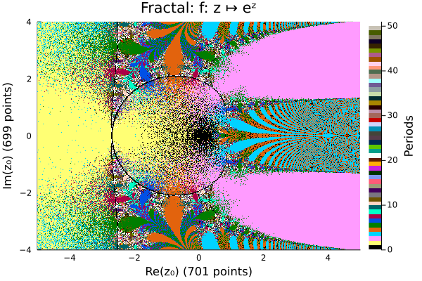

# Fractals.jl (WIP)
A repository containing simple Julia code for evaluating the divergence of continued functions.



Black: Could not determine within the computational period limit.
White: Divergent with period over 50.

## Usage
After cloning repo,
```julia
include("./src/Fractals.jl")
```
then
```julia
using .Fractals
using Plots
```

Define your recursion function.
```julia
f(z) = atan(z)
```
Specify the real and imaginary grid (preferably uniform).
```julia
x = LinRange(-1.5, 1.5, 701),
y = LinRange(-2, 2, 699)
```
Select a maximum period.
```julia
max_period = 10_000
```
Compute the fractal grid.
```julia
fractal = Fractal(
	"f: z ↦ atan(z)", # optional description of recursion function
	f, max_period, x, y
)
```
```
f: z ↦ atan(z) Period Grid (8 threads): 100%|████████████████████████████████████████| Time: 0:22:48
```

Plot as heatmap.
```julia
plot(fractal)
```


Another example, continued fractions.


## Implementation Features
* Multithreading on whatever number of threads Julia starts with, using `Base.Threads` package.
* Progress bar with ETA, using `ProgressMeter` package.
* `Double64` precision, using `DoubleFloats` package.
* Prescribed heatmap plot design specific for fractals developed by this module, using `RecipesBase` package.

## Author Notes/Dev TODOs
* Hunt down those allocations.
* Some regions don't yield the same patterns as results from others, e.g. cardiod of convergence for the continued exponential. Try a greater precision with BigFloat instead of Double64.
* Run with workers instead of threads.
